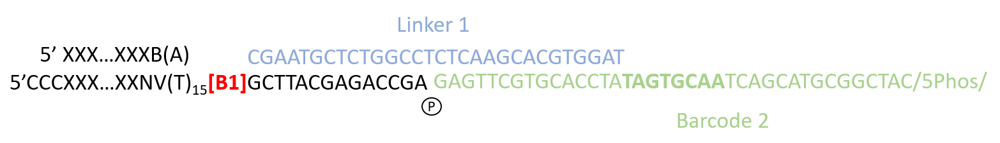
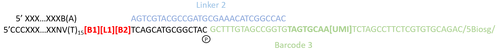
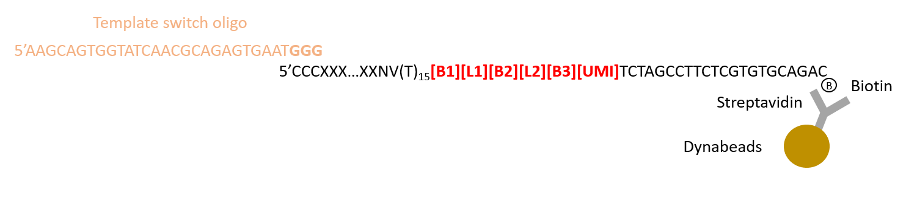
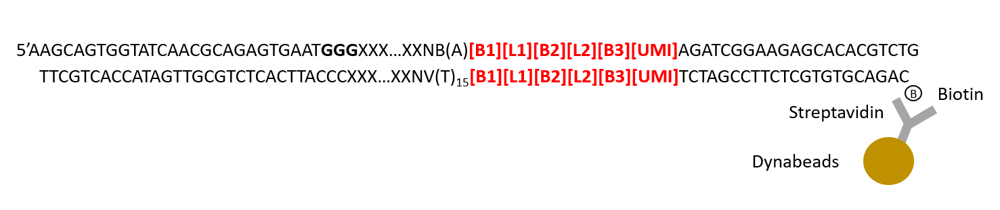
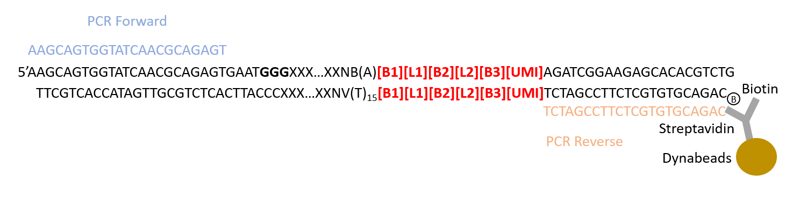
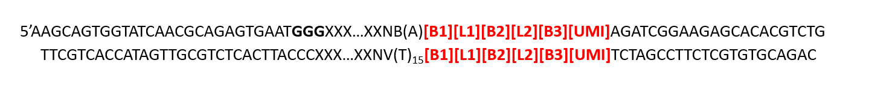

# SPLiT-seq
SPLiT-seq

## Overview
1. ACME
2. FACS
3. Plate preparation 
4. Round 1 barcoding: Reverse transcription
5. Round 2 barcoding: Ligation 1
6. Round 3 barcoding: Ligation 2
7. Cell lysis
8. cDNA purification with magnetic beads
9. Template switch
10. PCR amplification
11. Size selection
12. Tagmentation
13. Round 4 barcoding: PCR

## 3. Plate prepatation

## 4. Round 1: Reverse transcription
The round 1 barcode binds to the polyadenylation tail of mRNA. The Round 1 barcode has a 15 base T-tail binding to the polyA-tail and two nonbinding bases (NV). N is any base (A, C, G, or T), and V is A,C or G.

We use the Maxima H Minus RT enzyme to perform reverse transcription or "first strand synthesis". The Maxima H Minus RT enzyme is derived from the Moloney murine leukemia virus (MMLV). During first-strand synthesis, upon reaching the 5' end of the RNA template. the terminal transferase activity of the MMLV reverse transcriptase adds a few additional nucleotides (mostly deoxycytidine) to the 3' end of the newly synthesized cDNA strand. These bases function later as a template-switch (TS) oligo-anchoring site.

We now have a mRNA/DNA chimera:

We have to pay attention to RNAses and DNAses

### Protocol
1. Prepare 96-well plate (Round-1) on ice by transferring 4 \mu l / well from WD-1. 
2. Prepare 96 x 8 = 768 ul RT mix.
  * 4 ul 5X RT Buffer
  * 0.35 ul SUPERase-In RNAse Inhibitor
  * 1 ul dNTP mix (10 mM each)
  * 1.65 ul water
  * 1 ul Maxima H Minus RT
 3. 8 ul of previously counted cells (1.25 M cells/ml).
 4. Incubate 30 min 50C, palce on ice after this.
 5. Pool all 96 wells in a 15 ml Falcon tube.
 6. Add 9.6 ul 10% Triton-X-100 to the pooled cells.
 7. Centrifuge 1000g 5 min 4C
 8. Discard supernatant, resuspend the pellet in 2 ml 1x NEB buffer 3.1

## 5. Round 2: Ligation 1
Ligation is performed with the T4 DNA Ligase. This enzyme catalyzes the formation of a phosphodiester bond between juxtaposed 5' phosphate and 3' hydroxyl termini in duplex DNA or RNA. 

2ml ligation mix: 500 ul T4 Lugase Buffer 10x + 100 ul T4 DNA ligase + 1500 water.

A blocking solution is prepared with Blocker_1. Blocker_1 is complementary to Linker_1.

## 5. Round 3: Ligation 2

## 6. Cell lysis

**(Optional Stopping point)**

## 7. cDNA purification with magnetic beads

## 9. Template switch

## 10. PCR amplification

## 11. Size selection

## 12. Tagmentation
