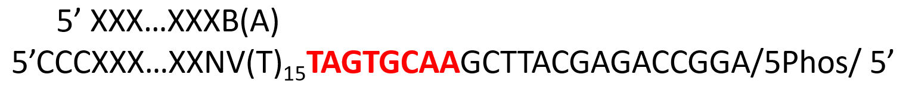

# splitseq
SPLiT-seq

## 4. Round 1: Reverse transcription
The round 1 barcode binds to the polyadenylation tail of mRNA. The Round 1 barcode has a 15 base T-tail binding to the polyA-tail and two nonbinding bases (NV). N is any base (A, C, G, or T), and V is A,C or G.

We use the Maxima H Minus RT enzyme to perform reverse transcription or "first strand synthesis". The Maxima H Minus RT enzyme is derived from the Moloney murine leukemia virus (MMLV). During first-strand synthesis, upon reaching the 5' end of the RNA template. the terminal transferase activity of the MMLV reverse transcriptase adds a few additional nucleotides (mostly deoxycytidine) to the 3' end of the newly synthesized cDNA strand. These bases function later as a template-switch (TS) oligo-anchoring site.

We now have a mRNA/DNA chimera:

We have to pay attention to RNAses and DNAses

## 5. Round 2: Ligation 1

